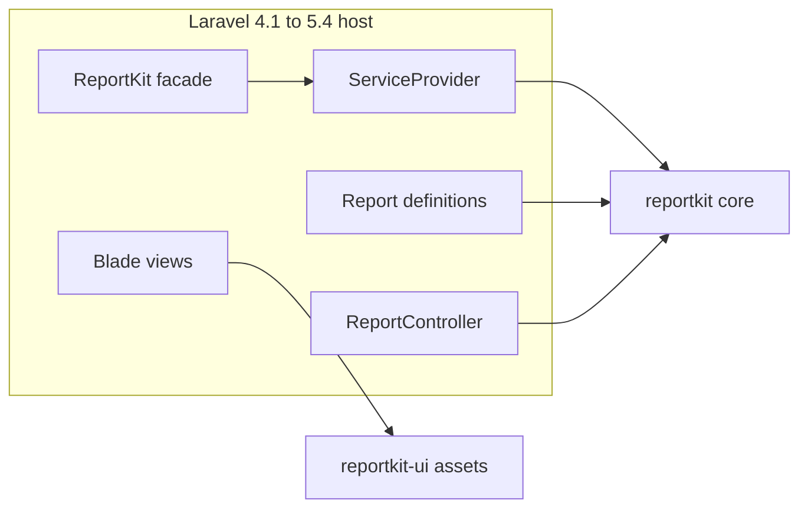
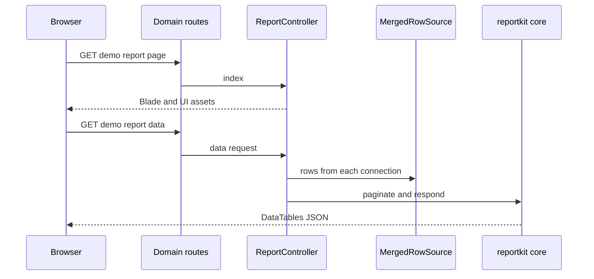

<p align="center">
  
</p>

<h1 align="center">ReportKit&nbsp;for&nbsp;Laravel&nbsp;(Legacy)</h1>

<p align="center"><strong>Multi-database report engine · Laravel 4.1 → all supported</strong></p>

<p align="center">
  
  <a href="https://packagist.org/packages/reportkit/laravel-legacy"></a>
  <a href="https://packagist.org/packages/reportkit/laravel-legacy"></a>
  
  
  <a href="LICENSE"></a>
</p>

<p align="center">
  <a href="https://reportkit.lorapok.tech"></a>
</p>

<p align="center">
  <a href="https://reportkit.lorapok.tech">Website &amp; Docs</a> ·
  <a href="docs/INSTALL.md">Install guide</a> ·
  <a href="docs/UPGRADE.md">Upgrade</a> ·
  <a href="https://github.com/Maijied/Reportkit-Core/tree/main/reportkit-laravel">Laravel 5.5 → 13</a>
</p>

> **Part of the Lorapok Labs ecosystem.** Classic Laravel adapter for [ReportKit Core](https://github.com/Maijied/Reportkit-Core). Same engine, same Artisan DX — tuned for pre-auto-discovery Laravel and PHP 5.6.

---

## What you get

- Service provider + `ReportKit` facade (manual registration for L4.1–5.4).
- `php artisan reportkit:install` — checklist + optional `--with-config --publish-assets`.
- `php artisan reportkit:make` — full-stack stubs (definition, repository, service, controller, blade, JS, test).
- CAS Blade partials under `reportkit::` and opt-in `ReportKit::routes()`.
- Never modifies your existing reports.

## Architecture



## DataTables request flow



---

## Requirements

- PHP **5.6 – 7.4**
- `reportkit/core` (beta channel allowed)
- Laravel **4.1 – 5.4** host
- `@lorapok-labs/reportkit-ui` assets copied into public

## Install

```bash
composer require reportkit/laravel-legacy
```

<details>
<summary>Install from Git (VCS)</summary>

```json
{
  "repositories": [
    { "type": "vcs", "url": "https://github.com/Maijied/Reportkit-Core.git" },
    { "type": "vcs", "url": "https://github.com/Maijied/Reportkit-Core.git" }
  ],
  "require": {
    "reportkit/core": "dev-main",
    "reportkit/laravel-legacy": "dev-main"
  }
}
```

</details>

Register in `app/config/app.php` (Laravel 4.1 style):

```php
'providers' => array(
    'ReportKit\\Laravel\\Legacy\\ReportKitServiceProvider',
),
'aliases' => array(
    'ReportKit' => 'ReportKit\\Laravel\\Legacy\\Facades\\ReportKit',
),
```

Then:

```bash
php artisan reportkit:install --with-config --publish-assets
php artisan reportkit:make Demo --route=admin/demo-report --preset=hybrid --layout=layouts.master
composer dump-autoload
```

`composer dump-autoload` is required for the L4.1 classmap. Full checklist: [docs/INSTALL.md](docs/INSTALL.md).

## Merge multiple databases

```php
use ReportKit\Core\Source\MergedRowSource;
use ReportKit\Laravel\Legacy\Source\ConnectionRowSource;

$domain = function ($query, array $filters) {
    return $query->from('orders')
        ->whereBetween('created_at', array($filters['start_date'], $filters['end_date']));
};

$live    = new ConnectionRowSource('mysql', $domain, null, 'live');
$archive = new ConnectionRowSource('mysql_archive', $domain, null, 'archive');

$source = new MergedRowSource(array($live, $archive));
$source->dedupeBy('id')->orderBy('created_at', 'desc');

$rows = $source->getRows($filters); // merged + deduped + sorted
```

---

## Ecosystem

| Package | Repo |
|---------|------|
| `reportkit/core` | [Reportkit-Core](https://github.com/Maijied/Reportkit-Core) |
| `reportkit/laravel-legacy` | This repository |
| `reportkit/laravel` | [reportkit-laravel/](https://github.com/Maijied/Reportkit-Core/tree/main/reportkit-laravel) (5.5 → 13) |
| `@lorapok-labs/reportkit-ui` | [reportkit-ui/](https://github.com/Maijied/Reportkit-Core/tree/main/reportkit-ui) |

## Author

**Mohammad Maizied Hasan Majumder** (Maijied) · Senior Software Engineer @ **Shohoz Ltd** · Founder and Principal Engineer @ **Lorapok Labs**  
Dhaka, Bangladesh · [mdshuvo40@gmail.com](mailto:mdshuvo40@gmail.com) · [GitHub @Maijied](https://github.com/Maijied)

Full profile: [AUTHORS.md](../AUTHORS.md)

## License

MIT © Mohammad Maizied Hasan Majumder / Lorapok Labs
