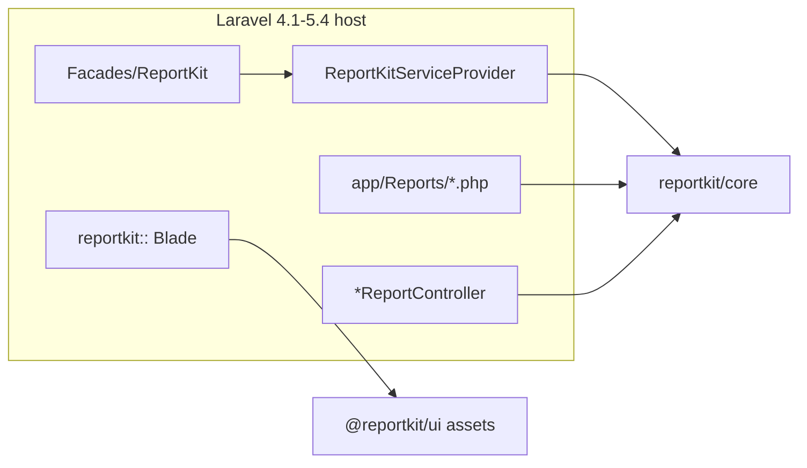
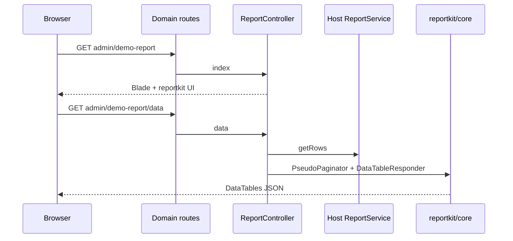

# reportkit/laravel-legacy

Laravel **4.1 – 5.4** adapter for [ReportKit Core](https://github.com/Maijied/Reportkit-Core).

Provides service provider, facade, CAS Blade partials (`reportkit::`), and Artisan:

- `php artisan reportkit:install`
- `php artisan reportkit:make {Name} --route=… --preset=hybrid --layout=… --flags=… --dry-run`

> PHP 5.6 – 7.4 · Pair with [`@reportkit/ui`](https://github.com/Maijied/Reportkit-UI) for CSS/JS  
> Repository: [Maijied/Reportkit-Laravel-Legacy](https://github.com/Maijied/Reportkit-Laravel-Legacy)

## Author

**Mohammad Maizied Hasan Majumder** \<mdshuvo40@gmail.com\>  
Founder & Principal Engineer at Lorapok Labs · Senior Software Engineer @ Shohoz Ltd

## Architecture



Consume flow for a DataTables page:



## Features

- Service provider + `ReportKit` facade
- View namespace `reportkit::` (CAS layout / filter / KPI / loader partials)
- `reportkit:install` checklist
- `reportkit:make` full stack stubs (definition, repository, service, controller, blade, JS, test)
- Opt-in `ReportKit::routes()` / `Http/routes.php` when `routes.enabled` is true (default **false**)
- Does **not** modify existing host reports

## Requirements

- PHP **5.6 – 7.4** (typical L4.1–5.4 range)
- `reportkit/core` `0.1.*|dev-main`
- Laravel **4.1 – 5.4** host
- `@reportkit/ui` assets copied into public (manual)

## Install

```bash
composer require reportkit/laravel-legacy
```

VCS (until Packagist):

```json
{
  "repositories": [
    { "type": "vcs", "url": "https://github.com/Maijied/Reportkit-Core.git" },
    { "type": "vcs", "url": "https://github.com/Maijied/Reportkit-Laravel-Legacy.git" }
  ],
  "require": {
    "reportkit/core": "dev-main",
    "reportkit/laravel-legacy": "dev-main"
  }
}
```

Register in `app/config/app.php` (Laravel 4.1 style):

```php
'providers' => array(
    // ...
    'ReportKit\\Laravel\\Legacy\\ReportKitServiceProvider',
),
'aliases' => array(
    // ...
    'ReportKit' => 'ReportKit\\Laravel\\Legacy\\Facades\\ReportKit',
),
```

Copy UI assets from [Reportkit-UI](https://github.com/Maijied/Reportkit-UI) into `public/css/reportkit/` and `public/js/reportkit/`:

- `reportkit.css`
- `reportkit-compat.css`
- `reportkit.js`

Then:

```bash
php artisan reportkit:install
```

Create `app/Reports/` — the provider auto-requires `*.php` on boot.

Full checklist: [docs/INSTALL.md](docs/INSTALL.md).

## Scaffold a NEW report

```bash
php artisan reportkit:make Demo --route=admin/demo-report --preset=hybrid --dry-run
php artisan reportkit:make Demo --route=admin/demo-report --preset=hybrid \
  --layout=layouts.master \
  --flags=datatables,sync,async_prepare,kpi,excel,csv,pdf
composer dump-autoload
```

- `--layout` defaults to `layouts.master` (bus host example: `--layout=public.admin_master`)
- Controllers are **global-namespace** under `app/controllers/admin/Reports/` — suggested routes use `DemoReportController@index`, not a `Reports\` prefix
- DataTables route shape: `{{route}}/data`
- `composer dump-autoload` is required for the L4.1 classmap

Does **not** modify existing reports. Add routes manually in your domain route file (or call `ReportKit::routes()` when `routes.enabled` is true).

Example routes:

```php
Route::get('admin/demo-report', 'DemoReportController@index');
Route::get('admin/demo-report/data', 'DemoReportController@data');
```

## Ecosystem

| Package | Repo |
|---------|------|
| `reportkit/core` | [Reportkit-Core](https://github.com/Maijied/Reportkit-Core) |
| `reportkit/laravel-legacy` | This repository |
| `reportkit/laravel` | [Reportkit-Laravel](https://github.com/Maijied/Reportkit-Laravel) (5.5 → current) |
| `@reportkit/ui` | [Reportkit-UI](https://github.com/Maijied/Reportkit-UI) |

## License

MIT © Mohammad Maizied Hasan Majumder / Lorapok Labs
